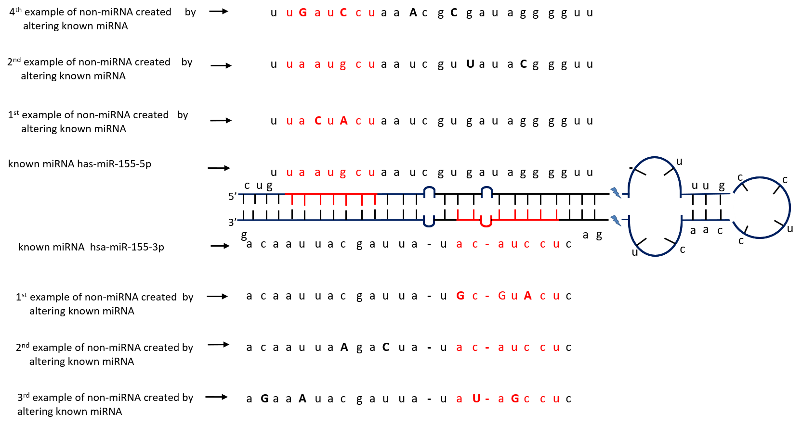

# miRSim



This aim of this tool is to generate the synthetic RNA-Seq sequences by mutating the seed and xseed region (extra sequence after removing seed) by following poisson or gamma error distribution. In addition to the synthetic sequences, this tool also generate the ground truth. This tool can be used to evalute the ability of the tool/pipeline to correctly identify the RNA sequences.

## Getting Started

### Prerequisites

This tool has been developed in Python (version 3.6.9). The following libraries are required to run miRSim sequence generation module:

```
-----------------------------------------------------
Packages                        Installation
-----------------------------------------------------
pandas                        pip install pandas
numpy                         pip install numpy
threading                     pip install threaded
-----------------------------------------------------
```
Rest of the requires packages such as `random,os,sys,gzip,time` are already included into python standard library.


### Installing

You can download this tool by cloning the github repository and use directly by switching to the tool directory.

```
git clone vivekruhela/miRSim
cd miRSim
```

## Arguments

```
usage: miRSim.py [-h] [-i INPUT] [-t [TOTAL_SEQ]] [-st STD_SEQ] [-nr NON_RNA]
                 [-s SEED_ERROR_SEQ] [-x XSEED_ERROR_SEQ]
                 [-b BOTH_SEED_XSEED_ERROR_SEQ] [-d MIN_DEPTH]
                 [-e ENCODING_QUALITY] [-se SEED] [-o OUT_PATH]
                 [-n OUT_FILE_NAME] [-g GROUND_TRUTH_FILE] [-gff GFF_FILE]
                 [-q OUT_FILE_TYPE] [-dist EXPRESSION_DISTRIBUTION]
                 [-a ADAPTOR] [-th THREAD] [-r REPLACEMENT] [-rna RNA_TYPE]

optional arguments:
  -h, --help            show this help message and exit
  -i INPUT, --input INPUT
                        Reference fasta file input. (default: None)
  -t [TOTAL_SEQ], --total_seq [TOTAL_SEQ]
                        Total number of sequence to be generated. (default:
                        50000)
  -st STD_SEQ, --std_seq STD_SEQ
                        Fraction of stadnard sequence out of total generated
                        sequence. (default: None)
  -nr NON_RNA, --non_rna NON_RNA
                        Fraction of Non RNA sequence out of total generated
                        sequence. (default: None)
  -s SEED_ERROR_SEQ, --seed_error_seq SEED_ERROR_SEQ
                        Fraction of sequence having impurity in seed region
                        out of total generated sequence. (default: None)
  -x XSEED_ERROR_SEQ, --xseed_error_seq XSEED_ERROR_SEQ
                        Fraction of sequence having impurity in xseed region
                        (extra region outside seed region) out of total
                        generated sequence. (default: None)
  -b BOTH_SEED_XSEED_ERROR_SEQ, --both_seed_xseed_error_seq BOTH_SEED_XSEED_ERROR_SEQ
                        Fraction of sequence having impurity in both seed and
                        xseed region outo of total generated sequence.
                        (default: None)
  -d MIN_DEPTH, --min_depth MIN_DEPTH
                        Minimum depth of sequence to be generated. (default:
                        5)
  -e ENCODING_QUALITY, --encoding_quality ENCODING_QUALITY
                        Quality score encoding for fastq file (33/64 for
                        fastq, 0 for fasta). (default: 33)
  -se SEED, --seed SEED
                        Seed (random/fixed-prided by user). (default: None)
  -o OUT_PATH, --out_path OUT_PATH
                        Path of saving output (fastq/fasta) file. (default:
                        None)
  -n OUT_FILE_NAME, --out_file_name OUT_FILE_NAME
                        Name of output sequence file (fastq/fasta). (default:
                        None)
  -g GROUND_TRUTH_FILE, --ground_truth_file GROUND_TRUTH_FILE
                        Name of output ground truth file. (default: None)
  -gff GFF_FILE, --gff_file GFF_FILE
                        GFF file. (default: None)
  -q OUT_FILE_TYPE, --out_file_type OUT_FILE_TYPE
                        Output file type. (default: fastq)
  -dist EXPRESSION_DISTRIBUTION, --expression_distribution EXPRESSION_DISTRIBUTION
                        Distribution type for expression values. (default:
                        poisson)
  -a ADAPTOR, --adaptor ADAPTOR
                        Adaptor Sequence. (default: TGGAATTCTCGGGTGCCAAGG)
  -th THREAD, --thread THREAD
                        Number of Parallel thread. (default: 4)
  -r REPLACEMENT, --replacement REPLACEMENT
                        Sample RNAs with replacement (default: True)
  -rna RNA_TYPE, --rna_type RNA_TYPE
                        RNA type (miRNA/piRNA/...). (default: miRNA)
```

### Example
(A) Basic Example: If you want to prepare the synthetic data having total number of sequences = 50000 and contains standard miRNA (let's say 50% i.e. 25000 sequences) and non-miRNAs (let's say 50% i.e. 25000 sequences)

```
python miRSim.py -i Sample_data/mature_high_conf_miRNA_hsa.fa -gff Sample_data/hsa_miRNA_high_conf.gff3 -st 50 -nr 50
```

(B) Advance Example: If you want to prepare the synthetic data that contains multiple type of RNAs (let's say mIRNA + piRNA + novel miRNA) with following proportion:

```
Total Number of sequence = 500000
% of pure miRNA sequence                                           = 20% (i.e. 20000 sequences)
% of miRNA sequence with error in seed region                      = 10% (i.e. 10000 sequences)
% of miRNA sequence with error in xseed region                     = 10% (i.e. 10000 sequences)
% of miRNA sequence with error in both seed and xseed region       = 5% (i.e. 5000 sequences)
% of pure piRNA sequences                                          = 10% (i.e. 10000 sequences)
% of piRNA sequence with error in seed region                      = 10% (i.e. 10000 sequences)
% of piRNA sequence with error in xseed region                     = 5% (i.e. 5000 sequences)
% of piRNA sequence with error in both seed and xseed region       = 5% (i.e. 5000 sequences)
% of pure novel miRNA                                              = 10% (i.e. 10000 sequences)
% of novel miRNA sequence with error in seed region                = 10% (i.e. 10000 sequences)
% of novel miRNA sequence with error in xseed region               = 3% (i.e. 3000 sequences)
% of novel miRNA sequence with error in both seed and xseed region = 2% (i.e. 2000 sequences)
                                                             
                                                             Total = 100%
```

In order to generate such data you need to call miRSim module separately for each RNA type using following commands `(assuming minimum depth=default, file_type=fastq, encoding_quality=33, adaptor=default)`:

```
For miRNA synthetic data

python miRSim.py -i Sample_data/mature_high_conf_miRNA_hsa.fa -n mirna_raw_data.fastq.gz -g mirna_ground_truth.csv -gff Sample_data/hsa_miRNA_high_conf.gff3 -t 500000 -st 20 -s 10 -x 10 -b 5 -se 1001 -th 6 -rna miRNA
```

```
For piRNA synthetic data

python miRSim.py -i Sample_data/piRNAdb.hsa.v1_7_5.fa -n pirna_raw_data.fastq.gz -g pirna_ground_truth.csv -gff Sample_data/pirnadb_hg38.gff3 -t 500000 -st 10 -s 10 -x 5 -b 5 -se 1001 -th 6 -rna piRNA
```

```
For novel miRNA synthetic data

python miRSim.py -i Sample_data/novel_seq.fa -n novel_mirna_raw_data.fastq.gz -g novel_mirna_ground_truth.csv -gff Sample_data/novel_miRNA.gff3 -t 500000 -st 10 -s 10 -x 3 -b 2 -se 1001 -th 6 -rna novelRNA
```
After generating synthetic data for each individual RNA, merge these fastq files and their ground truth csv. e.g.
```
zcat mirna_raw_data.fastq.gz pirna_raw_data.fastq.gz novel_mirna_raw_data.fastq.gz | gzip > synthetic_raw_data.fastq.gz
```

## Reference

Ruhela, Vivek et al., "miRSim: Seed-based Synthetic Sequence Simualtor"

## Authors

* **Vivek Ruhela** - *Initial work* - [github](https://github.com/vivekruhela)


## License

See the [LICENSE](LICENSE) file for license rights and limitations (Apache2.0).

## Acknowledgement

This work was supported by Infosys Centre for AI, IIIT Delhi.
