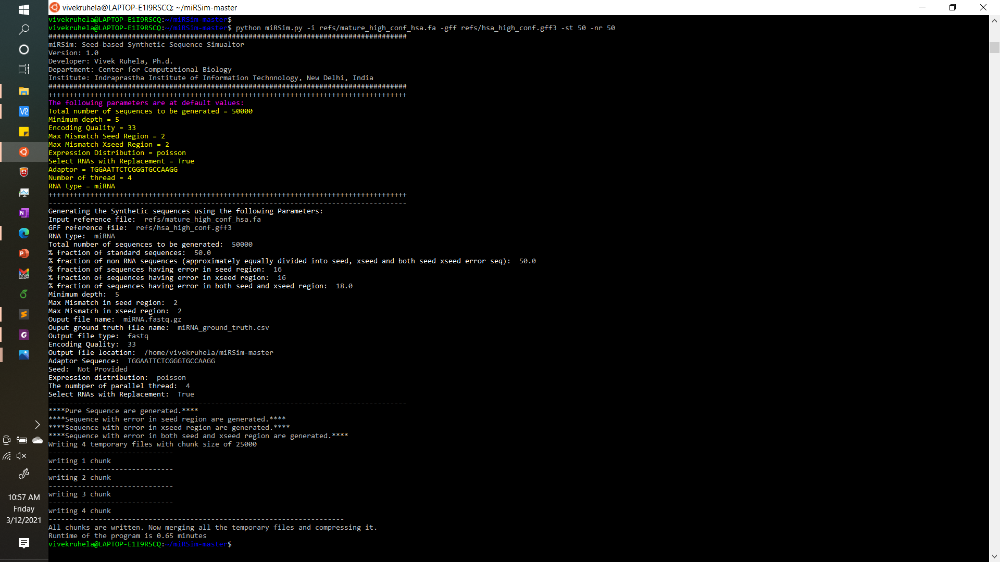
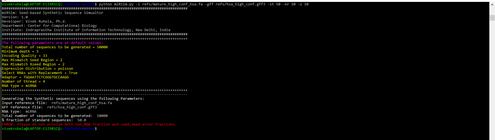

# miRSim Tutorial

### Printing arguments with help commands
Type the following command to print the help message and all arguments
```
python miRSim.py -h
```
By tying the above command, you should see the following response:


If you are not seeing this message, please check whether you have installed all the dependencies or not.

### Running at default conditions
After successfully installing all the dependencies and printing the help command, you can run the tool with minimum required parameters with the help of the following command:

```
python miRSim.py -i Sample_data/mature_high_conf_miRNA_hsa.fa -gff Sample_data/hsa_miRNA_high_conf.gff3 -st 50 -nr 50
```

By giving the above command, you should see the following response:


If the above command runs successfully, you should see two files in the current running directory i.e. `miRNA_ground_truth.csv` and `miRNA.fastq.gz` shown below:


### Running miRSim with error

You can give input as either "non_rna fraction" or all the three namely "seed, xseed region and seed+xseed togther error fraction" in the input command, but not both. If you have mistakenly given both arguents, you'll see the following error messages:



### Running miRSim with user-defined arguments:
If you don't want to generate data according to the default parameter values, then you can give your own parameters. E.g.

```
python miRSim.py -i Sample_data/mature_high_conf_miRNA_hsa.fa -gff Sample_data/hsa_miRNA_high_conf.gff3 -t 100000 -st 50 -s 20 -x 15 -b 15 -d 10 -e 0 -se 1001 -q fasta -dist gamma -a AAAGGGTTGGAAGCGGTGA -th 12
```
After giving the above commands you should get the following response:


### Final output files

You'll get two output files: 

1. Compressed Fastq/fasta file

2. Comma separated file (csv) as shown below:
